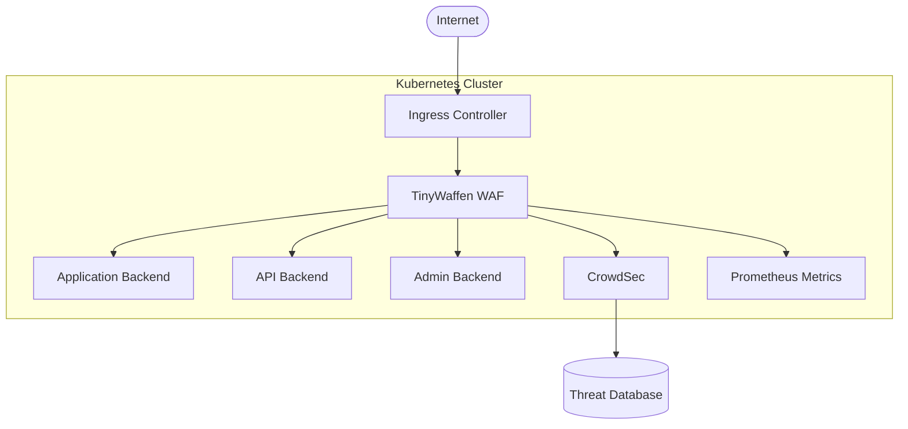

# TinyWaffen - Kubernetes-Native WAF Solution

A comprehensive, cloud-native Web Application Firewall (WAF) built on Caddy with enterprise-grade security features, designed for protecting modern applications and legacy systems in Kubernetes environments.

## 🚀 Features

### Core Security
- **Advanced WAF Rules** - SQL injection, XSS, path traversal, command injection protection
- **CrowdSec Integration** - Real-time crowd-sourced threat intelligence
- **Bot Protection** - Advanced bot detection and mitigation
- **Rate Limiting** - Configurable rate limiting with multiple strategies
- **Authentication Portal** - JWT-based authentication with OAuth2 support

### Infrastructure
- **Kubernetes Native** - Designed for cloud-native deployments
- **Horizontal Scaling** - Auto-scaling based on CPU/memory metrics
- **High Availability** - Multi-replica deployment with health checks
- **Monitoring Ready** - Prometheus metrics and Grafana dashboards
- **GitOps Friendly** - Helm charts and GitLab AutoDevOps support

### Performance
- **HTTP/3 Support** - Latest protocol support for improved performance
- **Intelligent Caching** - Configurable caching for static assets
- **Compression** - Gzip and Zstandard compression
- **Load Balancing** - Multiple backend support with health checks

## 🏗️ Architecture



## 🚀 Quick Start

### Prerequisites

- Kubernetes cluster (1.19+)
- Helm 3.x
- kubectl configured
- Domain with DNS management access

### Installation with Helm

```bash
# Add the TinyWaffen Helm repository
helm repo add tinywaffen https://charts.tinyland.dev
helm repo update

# Install TinyWaffen
helm install tinywaffen tinywaffen/tinywaffen \
  --set config.domain=your-domain.com \
  --set secrets.cloudflareToken=your-cloudflare-token \
  --set secrets.crowdsecApiKey=your-crowdsec-key \
  --set config.backends.app=http://your-app:3000
```

### Manual Kubernetes Deployment

```bash
# Apply Kubernetes manifests
kubectl apply -f k8s/
```

### Docker Compose (Development)

```bash
# Create environment file
cp .env.example .env
# Edit .env with your configuration

# Start services
docker-compose up -d
```

## ⚙️ Configuration

### Environment Variables

| Variable | Description | Default |
|----------|-------------|---------|
| `DOMAIN` | Primary domain | `localhost` |
| `CLOUDFLARE_API_TOKEN` | Cloudflare API token for DNS | - |
| `CROWDSEC_API_KEY` | CrowdSec API key | - |
| `JWT_SHARED_KEY` | JWT signing key | - |
| `APP_BACKEND` | Main application backend | `http://app:3000` |
| `API_BACKEND` | API backend service | `http://api:3000` |
| `ADMIN_BACKEND` | Admin backend service | `http://admin:8080` |

### WAF Rules Configuration

WAF rules are modular and can be enabled/disabled via Helm values:

```yaml
waf:
  rules:
    sqlInjection: true
    xssProtection: true
    pathTraversal: true
    commandInjection: true
    fileUploadRestrictions: true
  customRules: |
    # Your custom rules here
```

### Backend Configuration

Configure multiple backends with different security policies:

```yaml
backends:
  app:
    url: "http://app:3000"
    healthCheck: "/health"
    rateLimit: 100
  api:
    url: "http://api:3000"
    healthCheck: "/health"
    rateLimit: 50
    requireAuth: true
```

## 🔍 Monitoring and Observability

### Metrics Endpoints

- `/metrics` - Prometheus metrics (port 9090)
- `/health` - Health check endpoint
- `:2019/metrics` - Caddy admin metrics

### Grafana Dashboard

Import the included Grafana dashboard for comprehensive monitoring:

```bash
# Dashboard ID: tinywaffen-overview
kubectl apply -f monitoring/grafana-dashboard.yaml
```

### Log Analysis

Logs are structured in JSON format for easy parsing:

```json
{
  "ts": "2024-01-15T10:30:00Z",
  "level": "info",
  "msg": "request blocked",
  "remote_ip": "192.168.1.100",
  "method": "GET",
  "uri": "/admin",
  "rule": "sql_injection",
  "action": "block"
}
```

## 🔒 Security Considerations

### Network Policies

TinyWaffen includes network policies to restrict traffic:

- Only allows necessary ingress traffic
- Restricts egress to required services
- Isolates admin interfaces

### Resource Limits

Set appropriate resource limits:

```yaml
resources:
  limits:
    cpu: 500m
    memory: 512Mi
  requests:
    cpu: 100m
    memory: 128Mi
```

### Security Context

Runs with minimal privileges:

```yaml
securityContext:
  runAsNonRoot: true
  runAsUser: 1000
  readOnlyRootFilesystem: true
  allowPrivilegeEscalation: false
```

## 🔧 Development

### Building from Source

```bash
# Build Docker image
docker build -t tinywaffen:dev .

# Run tests
docker run --rm tinywaffen:dev caddy validate --config /etc/caddy/Caddyfile
```

### Local Development with Hot Reload

```bash
# Use development compose file
docker-compose -f docker-compose.dev.yml up
```

### Contributing

1. Fork the repository
2. Create a feature branch
3. Make your changes
4. Add tests
5. Submit a pull request

## 📚 Integration Examples

### With TinyMachines

TinyWaffen is designed to work seamlessly with TinyMachines development environments:

```bash
# In your tinymachine
tinymachine create web-app --waf tinywaffen
```

### With Existing Applications

Protect any application with minimal configuration:

```yaml
# Helm values
config:
  backends:
    myapp: "http://my-existing-app:8080"
  domain: "myapp.example.com"
```

## 🆘 Troubleshooting

### Common Issues

**WAF blocking legitimate traffic:**
```bash
# Check WAF logs
kubectl logs -l app=tinywaffen | grep blocked

# Adjust rules in values.yaml
waf:
  rules:
    sqlInjection: false  # Temporarily disable
```

**CrowdSec connection issues:**
```bash
# Verify CrowdSec connectivity
kubectl exec -it deployment/tinywaffen -- curl -I http://crowdsec:8080/health
```

**SSL certificate issues:**
```bash
# Check certificate status
kubectl describe certificate tinywaffen-tls
```

## 📄 License

MIT License - see [LICENSE](LICENSE) file for details.

## 🤝 Support

- 📖 [Documentation](https://docs.tinywaffen.io)
- 🐛 [Issue Tracker](https://github.com/yourusername/tinywaffen/issues)
- 💬 [Discussions](https://github.com/yourusername/tinywaffen/discussions)
- 📧 [Email Support](mailto:support@tinywaffen.io)

---

**Made with ❤️ for the cloud-native security community**